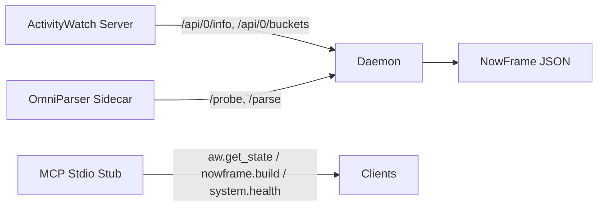

# CL_000_OP — AW + OmniParser MCP

A Rust-first control plane that combines **ActivityWatch (AW)** context with **OmniParser** UI parsing. The system is designed to be safe-by-default, read-only against AW, and friendly to constrained Windows environments.



## Project Positioning

- **Rust control plane**: health, triggers, NowFrame assembly, MCP stub.
- **Python sidecar**: mock (stdlib) or real OmniParser (optional).
- **No automatic CUDA/Torch changes**: all sensitive packages are protected.

## Quick Start (Windows)

### 1) Mock Sidecar (safe, no ML deps)

```powershell
# Start mock sidecar
F:\aw-omni\src\scripts\run_sidecar_entry_win.ps1 -Mode mock

# Start daemon
F:\aw-omni\src\scripts\run_daemon_win.ps1

# Start MCP (stdio JSON-RPC stub)
F:\aw-omni\src\scripts\run_mcp_win.ps1
```

### 2) Real Sidecar (OmniParser required)

- Add OmniParser as a submodule or external clone under `third_party/OmniParser`.
- Apply the local patch: `docs/patches/omniparser-local.patch`.
- Place weights under `F:\aw-omni\models\omniparser`.

```powershell
# Start real sidecar (untitled env example)
D:\exe\environment\anaconda\envs\untitled\python.exe F:\aw-omni\src\sidecar\omni_sidecar_entry.py `
  --mode real_local_untitled `
  --host 127.0.0.1 --port 8000 `
  --real-repo F:\aw-omni\src\third_party\OmniParser `
  --weights-root F:\aw-omni\models\omniparser
```

## Configuration

- `config/local.win.toml`
- `config/local.wsl.toml`

All paths are expected to be on **F:** to keep large artifacts out of system disks. The system will **not** modify Torch/CUDA/OpenCV stacks automatically.

## Protocol Documentation

- `docs/protocols/AW_PROTOCOL.md`
- `docs/protocols/OMNIPARSER_SIDECAR_PROTOCOL.md`
- `docs/protocols/MCP_TOOL_CONTRACT.md`
- `DATA_GOVERNANCE.md`

## Troubleshooting

- **NumPy / OpenCV conflicts**: use guarded install scripts in `scripts/`.
- **Weights missing**: check `F:\aw-omni\models\omniparser`.
- **Cache paths**: ensure `F:\aw-omni\cache` is writable.
- **Sidecar not ready**: call `/probe` and inspect `reason` / `missing_*` fields.

## Safety & Stability

- This repo does **not** modify AW configuration.
- Torch/CUDA/OpenCV are treated as **protected** packages.
- Heavy artifacts (models/cache/runtime/logs) are excluded from version control.

## License

- This repository is licensed under MPL-2.0. See `LICENSE`.
- Third-party license references: `THIRD_PARTY_NOTICES.md`.
