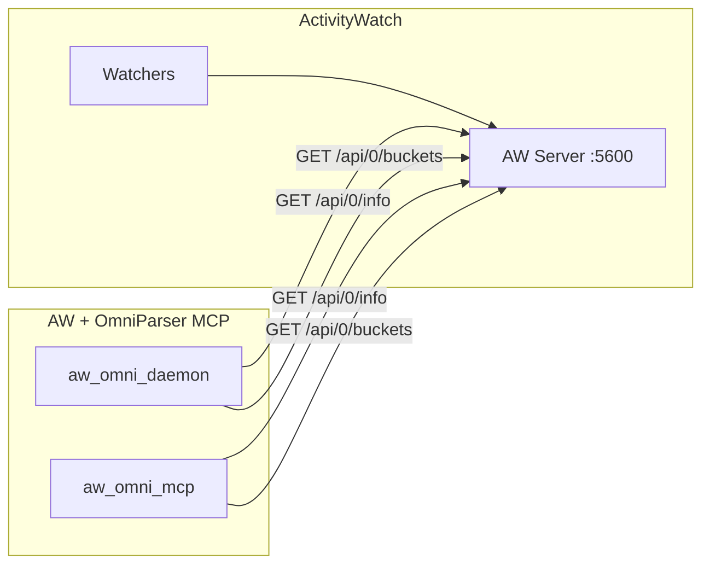

# ActivityWatch Protocol (Read-Only)

This document describes the ActivityWatch (AW) read-only contract used by this project. The MCP and daemon only **read** AW state for context; they do not write events or manage watchers.



## Base URL

- Default: `http://127.0.0.1:5600/api/0`

## Data Model (Buckets + Events)

ActivityWatch stores time series events inside **buckets**. A bucket has metadata (id, type, hostname, client) and contains **events**. Events use an ISO-8601 timestamp, a duration in seconds, and an arbitrary `data` object for watcher-specific payload. Bucket IDs are typically namespaced by watcher (for example, `aw-watcher-window-...`).

## Endpoints Used

### `GET /api/0/info`

Returns server info and version.

Example response:

```json
{
  "hostname": "YOUR-HOST",
  "version": "0.x.y",
  "testing": false
}
```

### `GET /api/0/buckets`

Returns a map of bucket IDs to bucket metadata.

Example response:

```json
{
  "aw-watcher-window-YOUR-HOST": {
    "id": "aw-watcher-window-YOUR-HOST",
    "type": "currentwindow",
    "hostname": "YOUR-HOST",
    "client": "aw-watcher-window",
    "created": "2025-01-01T00:00:00Z"
  }
}
```

## Implementation Notes

- This project is **read-only** against AW. No event ingestion occurs here.
- For deeper event queries (not currently used), AW supports time-range queries under `/api/0/buckets/{bucket_id}/events`.
- Ensure AW is running and reachable on localhost before calling MCP or daemon.
