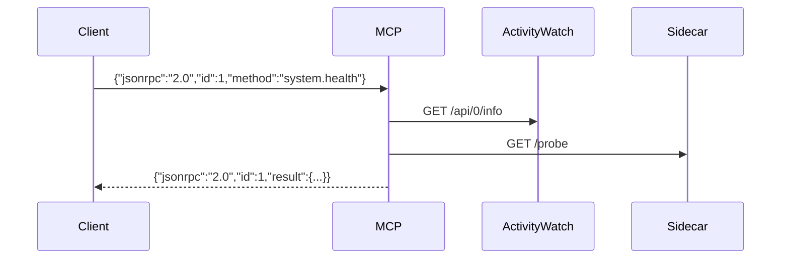

# MCP Tool Contract

This project exposes a minimal JSON-RPC 2.0 style MCP stub over stdio. Each request is a single JSON line; each response is a single JSON line.



## Transport

- Input: JSON lines on stdin
- Output: JSON lines on stdout
- Errors follow JSON-RPC error object with `code` and `message`

## Tools

### `aw.get_state`

**Request**

```json
{"jsonrpc":"2.0","id":1,"method":"aw.get_state"}
```

**Response**

```json
{
  "jsonrpc":"2.0",
  "id":1,
  "result": {
    "info": { "hostname": "...", "version": "..." },
    "buckets": { "aw-watcher-window-...": { "id": "..." } }
  }
}
```

**Failure semantics**

- Fails if AW is unreachable or returns invalid JSON.
- Error code: `-32601` with a descriptive message.

**Idempotency**: Read-only, safe to retry.

---

### `nowframe.build`

**Request**

```json
{"jsonrpc":"2.0","id":2,"method":"nowframe.build","params":{"reason":"manual"}}
```

**Response**

```json
{
  "jsonrpc":"2.0",
  "id":2,
  "result": {
    "timestamp": "2025-01-01T00:00:00Z",
    "reason": "manual",
    "aw_info": { ... },
    "aw_buckets": { ... },
    "omni_probe": { ... }
  }
}
```

**Failure semantics**

- The call is best-effort: if AW or sidecar fails, the corresponding field is `null`.
- JSON serialization errors return `-32601`.

**Idempotency**: Read-only, safe to retry.

---

### `system.health`

**Request**

```json
{"jsonrpc":"2.0","id":3,"method":"system.health"}
```

**Response**

```json
{
  "jsonrpc":"2.0",
  "id":3,
  "result": {
    "aw_ok": true,
    "sidecar_probe_status": true,
    "preflight_ok": true,
    "protected_env_ok": true,
    "protected_diff_count": 0,
    "omni_probe": { ... }
  }
}
```

**Failure semantics**

- Returns error only if the request itself is malformed.
- Health flags degrade gracefully when AW/sidecar are down.

**Idempotency**: Read-only, safe to retry.
