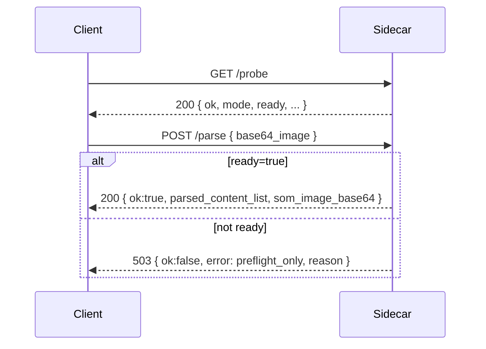

# OmniParser Sidecar Protocol

This sidecar exposes a lightweight HTTP API for image parsing. The protocol is intentionally small and **compatible across mock and real modes**.



## Base URL

- Default: `http://127.0.0.1:8000`

## Endpoint: `GET /probe`

Returns readiness and environment status. **Clients should treat all fields as optional** and only rely on `ok`/`ready` when present.

### Response Fields (Real Modes)

| Field | Type | Description |
| --- | --- | --- |
| `ok` | boolean | true if sidecar is ready for parsing |
| `ready` | boolean | same as `ok` (explicit readiness) |
| `mode` | string | `real_local_aliyun39` or `real_local_untitled` |
| `preflight_ok` | boolean | imports succeeded |
| `reason` | string | `ready`, `imports_missing`, `repo_missing`, `weights_missing` |
| `missing_imports` | array | missing required modules |
| `optional_missing` | array | optional modules (paddle/paddleocr) |
| `missing_files` | array | missing repo/files |
| `missing_weights` | array | missing weight files |
| `required_weights` | object | expected weight paths |
| `versions` | object | imported module versions |

### Response Fields (Mock Mode)

| Field | Type | Description |
| --- | --- | --- |
| `ok` | boolean | always true |
| `model` | string | `omniparser-mock` |
| `gpu` | string | `unknown` |

## Endpoint: `POST /parse`

### Request Body

- `base64_image` (string, required) – base64-encoded image data.
- `image_base64` is accepted as an alias for compatibility.

### Success Response (Real or Mock)

```json
{
  "ok": true,
  "latency": 0.123,
  "latency_ms": 123,
  "parsed_content_list": [],
  "som_image_base64": ""
}
```

### Error Responses

- `400` with `{ "ok": false, "error": "invalid_json" }`
- `400` with `{ "ok": false, "error": "missing_base64_image" }`
- `503` with `{ "ok": false, "error": "preflight_only", "reason": "weights_missing" }`
- `500` with `{ "ok": false, "error": "init_failed" | "parse_failed" }`

## Mode Behavior

- `mock`: stdlib-only, deterministic responses for development.
- `real_local_aliyun39`: uses Aliyun39 environment and real OmniParser.
- `real_local_untitled`: uses untitled environment for full OCR + caption.

Clients should:

- Always call `/probe` first and gate `/parse` on `ready == true`.
- Use exponential backoff if `ready == false` (weights/imports still initializing).
